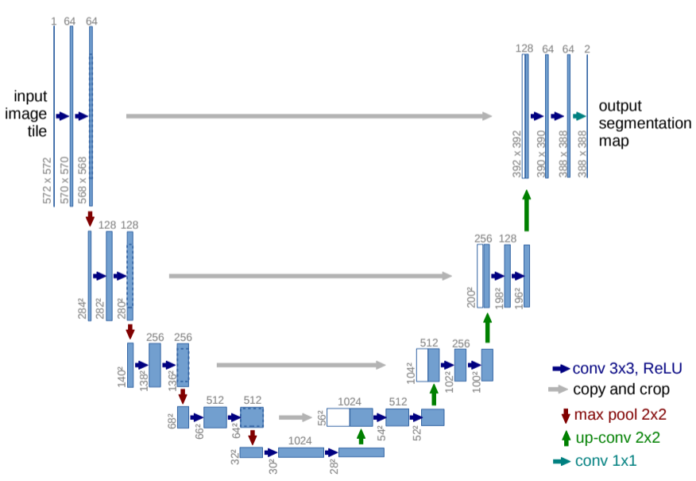
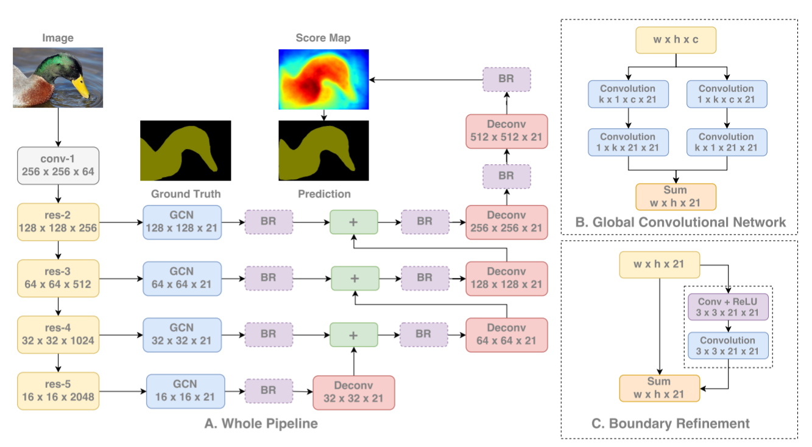

# Segmentation

This repository contains tensorflow implemenation of two models for semantic segmentations known to give high accuracy:

* **U-net** (https://arxiv.org/abs/1505.04597) : The network can be found in [u_net.py](./u_net.py). Here, is the architecture which I have borrowed from the paper :

There are a few minor differences in my implementation. I have used 'same' padding to simplify things. For the upsampling, I have simply used `tf.resize` function (see [layers_unet.py](./layers_unet.py) . The full transpose convolution (deconvolution) layer is used for FCN described next. 

* **FCN** with **global convolution network**  (https://arxiv.org/abs/1703.02719) : The network can be found in [fcn_gcn_net.py](./fcn_gcn_net.py). Here, is the architecture which I have borrowed from the paper :

Again, there are a few minor differences in my implementation. In particular, I have used VGG style encoder instead of ResNet blocks. All the layers/blocks used in the architecture (including the deconvolution layer) can be found in [layers_fcn_gcn_net.py](./layers_fcn_gcn_net.py)

#### ***Kaggle - Carvana image masking challenge***
I applied these models to one of the Kaggle competetions where the background behind the object (in this case : cars) had to be removed. More details can be found here : [Kaggle : Carvana image masking challenge](https://www.kaggle.com/c/carvana-image-masking-challenge). Due to lack of time and resources, I ended up making only a *single submission* and got a score of **99.2%** (winning solution had a score of 99.7%). 

**Scope for improvement** :
There are several strategies that could have improved the score but I did not use due to lack of time:

* Image preprocessing and data augmentation 
* Use higher resolution images : I was using AWS which wasn't fast enough to handle high resolution images. So, I had to scale down images considerably which leads to lower accuracy.
* Tiling sub-regions of high resolution image : This strategy will ensure that each tile can fit in the GPU but is obviously more time consuming. 
* Apply Conditional Random Field post-processing
  